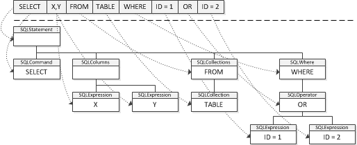
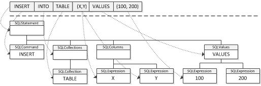
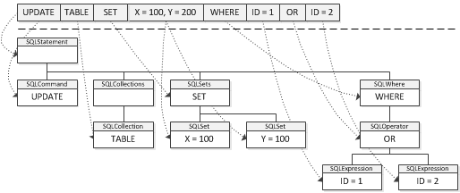
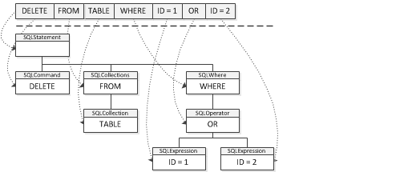
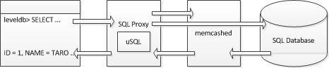
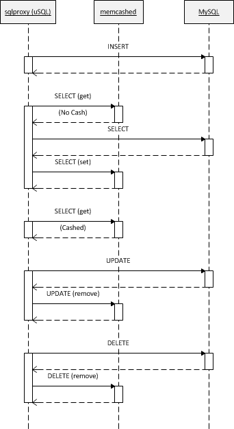

# µSQL for C++

## Introduction

### What is µSQL ?

µSQL is a SQL parser engine for C++ to develop SQL based applications easily, and it supports other SQL like domain specific languages such as [UnQL](http://www.unqlspec.org/display/UnQL/Home) and [GQL]([https://developers.google.com/appengine/docs/python/datastore/gqlreference) too. Because µSQL is written only in old standard C++ library such as STL with [ANTLR]([http://www.antlr.org/]), then you can use it with many C++ compilers and platforms.

### Repository

Please check the following site to get the latest source code and check the doxygen documentation.

- [GitHub](https://github.com/cybergarage/uSQL4CC)
- [Doxygen](http://www.cybergarage.org/doxygen/usql/)

## Getting Started

### System Requirements

To install µSQL, you have to the following package on your platform.  µSQL use the library to run the parser which is generated by [ANTLR](http://www.antlr.org/).

- [ANLTR (C runtime distributions)](http://www.antlr.org/download/C)

If you want to compile all examples of µSQL, you have to install the following packages too.

- [Boost (filesystem)](http://www.boost.org/)
- [MySQL (libmysqlclient)](http://www.mysql.com/)
- [leveldb](http://code.google.com/p/leveldb/)
- [libmemcached](http://libmemcached.org/)
- [OpenSSL (libcrypto)](http://www.openssl.org/)
- [libedit](https://sourceforge.net/projects/libedit/)

### Installation

On UNIX platform, you run the following commands to install the header files and library of µSQL. To compile the examples too, please add '--enable-examples' option into the configure script.

```
$ ./configure
$ make
$ sudo make install
```

## Using APIs

### Parsing SQL

µSQL has some parser classes which are subclass of  [uSQL::SQLParser](http://www.cybergarage.org/doxygen/usql/classuSQL_1_1SQLParser.html). For example, use [uSQL::SQL92Parser](http://www.cybergarage.org/doxygen/usql/classuSQL_1_1SQL92Parser.html) to parse SQL92 statements as the following.

```
const char *sqlString = "SELECT * FROM TESTDB";
uSQL::SQL92Parser sqlParser;
if (sqlParser.parse(inputLine) == false) {
  uSQL::SQLError *sqlError = sqlParser.getError();
  std::cout << "Parser Error :  " << inputLine;
  std::cout << "  Line = " << sqlError->getLine() << ", Offset = " << sqlError->getOffset() << std::endl;
}
```

### Getting Parsed Statements and Tokens

The parsed statements are stored in [uSQL::SQLStatement](http://www.cybergarage.org/doxygen/usql/classuSQL_1_1SQLStatement.html) instances, the tokens in the statement are stored in [uSQL::SQLNode](http://www.cybergarage.org/doxygen/usql/classuSQL_1_1SQLNode.html) instances. [uSQL::SQLNode](http://www.cybergarage.org/doxygen/usql/classuSQL_1_1SQLNode.html) is a super class for all parsed token objects, and the parsed SQL statement is represented as a tree consisting of the subclass instances. The following example outputs all parsed tokens to a console.

```
static void PrintSQLNodes(uSQL::SQLNode *node)
{
  std::oss << node->getValue() << std::endl;
  uSQL::SQLNodeList *childNodes = node->getChildNodes();
  std::size_t numChildren = childNodes->size();
  for (int n=0; n<numChildren; n++)
  PrintSQLNodes(childNodes->getNode(n));
}

....

uSQL::SQL92Parser sqlParser;
....
uSQL::SQLStatementList *stmtList = sqlParser.getStatements();
for (uSQL::SQLStatementList::iterator stmt = stmtList->begin(); stmt != stmtList->end(); stmt++) {
  uSQL::SQLNodeList *childNodes = (*stmt)->getChildNodes();
  std::size_t numChildren = childNodes->size();
  for (int n=0; n<numChildren; n++)
  PrintSQLNodes(childNodes->getNode(n));
}
```

To get the target tokens more directly, [uSQL::SQLStatement](http://www.cybergarage.org/doxygen/usql/classuSQL_1_1SQLStatement.html) has some useful methods such as the getCommandNode() as the following.

```
SQLStatement *stmt = ....
SQLCommand *sqlCmd = stmt->getCommandNode();
if (!sqlCmd) {
  ....
}
SQLColumns *sqlColumn = stmt->getColumnsNode();
if (!sqlColumn) {
  ....
}
SQLValues *sqlValue = stmt->getValuesNode();
if (!sqlValue) {
  ....
}
```

## Examples for Parsing

Actually, the parsed SQL statements is represented as a tree consisting of the subclass instances of [uSQL::SQLNode](http://www.cybergarage.org/doxygen/usql/classuSQL_1_1SQLNode.html) as the following.

### Example 1. SELECT



### Example 2. INSERT



### Example 3. UPDATE



### Example 4. DELETE



## Sample Applications using µSQL

µSQL includes the following useful sample applications to know how to use the APIs.

| Sample | Description |
|---|---|
| sqlparse | Simple application to parse SQL statements using µSQL |
| sqlproxy | SQL proxy application for SQL databases such as !MySQL using memcached |
| leveldb | Command line utility for leveldb to operate the database using SQL |

###  sqlparse

The sample is a simple utility to parse input SQL commands. Using the utility, you can see the parsed tree visually as the following.

```
$ ./sqlparse
µSQL> INSERT INTO TESTDB (ID, NAME, ADDR) VALUES (1, "TARO", "TOKYO")
INSERT INTO TESTDB (ID,NAME,ADDR) VALUES (1,"TARO","TOKYO")
|-- INSERT INTO (SQLCommand)
|-- TESTDB (SQLCollections)
| |-- TESTDB (SQLCollection)
|-- (ID,NAME,ADDR) (SQLColumns)
| |-- ID (SQLExpression)
| |-- NAME (SQLExpression)
| |-- ADDR (SQLExpression)
|-- VALUES (1,"TARO","TOKYO") (SQLValues)
| |-- 1 (SQLExpression)
| |-- "TARO" (SQLExpression)
| |-- "TOKYO" (SQLExpression)

µSQL> UPDATE TESTDB SET NAME = "TARO", ADDR = "TOKYO" WHERE ID = 1
UPDATE TESTDB SET NAME = "TARO",ADDR = "TOKYO" WHERE ID = 1
|-- UPDATE (SQLCommand)
|-- TESTDB (SQLCollections)
| |-- TESTDB (SQLCollection)
|-- SET NAME = "TARO",ADDR = "TOKYO" (SQLSets)
| |-- NAME = "TARO" (SQLSet)
| | |-- "TARO" (SQLExpression)
| |-- ADDR = "TOKYO" (SQLSet)
| | |-- "TOKYO" (SQLExpression)
|-- WHERE ID = 1 (SQLWhere)
| |-- ID = 1 (SQLOperator)
| | |-- ID (SQLExpression)
| | |-- 1 (SQLExpression)

µSQL> SELECT * FROM TESTDB WHERE ID = 1
SELECT * FROM TESTDB WHERE ID = 1
|-- SELECT (SQLCommand)
|-- * (SQLColumns)
| |-- * (SQLExpression)
|-- FROM TESTDB (SQLCollections)
| |-- TESTDB (SQLCollection)
|-- WHERE ID = 1 (SQLWhere)
| |-- ID = 1 (SQLOperator)
| | |-- ID (SQLExpression)
| | |-- 1 (SQLExpression)

µSQL> DELETE FROM TESTDB WHERE ID = 1 AND ID = 2
DELETE FROM TESTDB WHERE ID = 1 AND ID = 2
|-- DELETE FROM (SQLCommand)
|-- TESTDB (SQLCollections)
| |-- TESTDB (SQLCollection)
|-- WHERE ID = 1 AND ID = 2 (SQLWhere)
| |-- ID = 1 AND ID = 2 (SQLOperator)
| | |-- ID = 1 (SQLOperator)
| | | |-- ID (SQLExpression)
| | | |-- 1 (SQLExpression)
| | |-- ID = 2 (SQLOperator)
| | | |-- ID (SQLExpression)
| | | |-- 2 (SQLExpression)
```

### sqlproxy

The sample is a command line utility to cash query results of SQL databases such as [MySQL](http://www.mysql.com/) using [memcached](http://memcached.org/). The utility runs as a SQL proxy as the following diagram.



To cash query data using [memcached]([http://memcached.org/), the proxy generates a key for [memcached]([http://memcached.org/) based on the table name and the expressions of the 'where' section in the specified SQL. Using the generated key, the proxy sets or gets the result data when SELECT command is specified, removes the result data when UPDATE or DELETE commands are specified as the following.



The following is an example for using the utility.

```
$ ./sqlproxy -s 192.168.xxx.xxx -u root -d testdb
Server   : 192.168.xxx.xxx
User     : root
Database : testdb
sqlproxy> INSERT INTO TESTDB (ID, NAME, ADDR) VALUES (1, "TARO", "TOKYO")
Done.

sqlproxy> SELECT * FROM TESTDB WHERE ID = 1
[ADDR] = TOKYO
[ID] = 1
[NAME] = TARO
Done.

sqlproxy> SELECT * FROM TESTDB WHERE ID = 1
[ADDR] = TOKYO
[ID] = 1
[NAME] = TARO
Done(Cashed).
```

### leveldb

The sample is a command line utility for [leveldb](http://code.google.com/p/leveldb/) to operate the database using SQL commands like other database systems such as !MySQL and sqlite. The utility runs as a SQL proxy for [leveldb](http://code.google.com/p/leveldb/) as the following diagram.


To execute SQL commands using [leveldb](http://code.google.com/p/leveldb/), the proxy generates a key for leveldb based on the table name and the first expression of the 'where' section in the specified SQL as the following.

| SQL Example| Key for leveldb |
|---|---|
| SELECT * FROM *TESTDB* WHERE *ID = 1* | TESTDB ID = 1 |
| INSERT INTO *TESTDB* (*ID*, NAME, ADDR) VALUES (*1*, TARO, TOKYO) | - |
| UPDATE *TESTDB* SET NAME = "TARO", ADDR = "TOKYO" WHERE *ID = 1* | - |
| DELETE FROM *TESTDB* WHERE *ID = 1* | - |

The following is an example for using the utility to operate [leveldb](http://code.google.com/p/leveldb/) using SQL commands.

```
$ ./leveldb /tmp/testdb
Filename : /tmp/testdb
leveldb> INSERT INTO TESTDB (ID) VALUES (1)
Done.

leveldb> SELECT * FROM TESTDB WHERE ID = 1
[ID] = 1
Done.

leveldb> UPDATE TESTDB SET NAME = "TARO", ADDR = "TOKYO" WHERE ID = 1
Done.

leveldb> SELECT * FROM TESTDB WHERE ID = 1
[ADDR] = TOKYO
[ID] = 1
[NAME] = TARO
Done.
```

## Limitations

µSQL is under development, then it doesn't support all SQL syntax. I will support SQL92, UnQL and GQL finally, but please check [the syntax file of ANTLR](https://github.com/cybergarage/µSQL4CC/blob/master/src/µSQL/parser/antlr/SQL.g) directly if you want to know the current implementation state in more detail.
